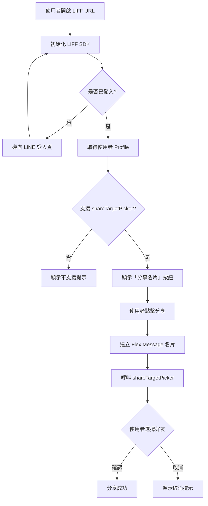

# LINE 名片分享 LIFF App

透過 LINE LIFF 讓使用者登入後，將個人名片以 Flex Message 分享給 LINE 好友或群組。

## 功能特性

- LINE 登入驗證（自動導向 LINE OAuth）
- 取得登入者 Profile（顯示名稱、大頭照）
- 以 Flex Message 格式建立名片卡片
- 透過 `shareTargetPicker` 分享給單一或多位好友／群組

## 線上 Demo

https://chaoowen.github.io/test-line-message/

## 業務流程



## 前置設定

### 階段一：建立 LINE Login Channel 與 LIFF App

1. 前往 [LINE Developers Console](https://developers.line.biz)，登入 LINE 帳號
2. 建立 Provider（輸入名稱後點 Create）
3. 在 Provider 底下建立 **LINE Login** channel（選 Web app）
4. 切到 **LIFF** 分頁 → 點「Add」，填寫以下欄位：

| 欄位 | 填什麼 | 說明 |
|------|--------|------|
| LIFF app name | 任意名稱 | 如「名片分享」 |
| Size | Full | 全螢幕，分享頁建議使用 |
| Endpoint URL | 你的網頁網址 | 部署後填入，先暫填 https 網址 |
| Scopes | profile、openid | 取得使用者登入資訊 |
| Bot link feature | Off | 可後續調整 |

建立後取得 **LIFF ID**（格式：`20XXXXXXX-XXXXXXX`）及 **LIFF URL**，請記下備用。

### 階段二：啟用 ShareTargetPicker（必要步驟）

`shareTargetPicker` 預設關閉，需手動同意條款：

1. 進入該 LINE Login channel → LIFF 分頁
2. 找到 **shareTargetPicker** 設定並點開
3. 閱讀「資訊使用同意書」，勾選同意後點 **Enable**

> 每個 Channel 需各自設定一次，未啟用則 `liff.shareTargetPicker()` 無法運作。

### 階段三：發布 Channel

1. 進入 LINE Login channel
2. 若狀態顯示 **Developing**，點擊後切換為 **Published**

## 安裝與使用

此為純前端單頁應用，無需安裝依賴。

### 本地開發

1. Clone 此專案
2. 開啟 `index.html`，將 `LIFF_ID` 替換為你的 LIFF ID：

```javascript
const LIFF_ID = "你的 LIFF ID";
```

3. 部署至任何支援 HTTPS 的靜態空間（GitHub Pages、Vercel 等）
4. 將 Endpoint URL 更新至 LINE Developers Console

### 自訂名片內容

編輯 `index.html` 中的 `buildFlexCard` 函數：

```javascript
function buildFlexCard(displayName) {
  // hero.url      → 名片圖片網址（需為公開 HTTPS）
  // body.contents → 姓名、職稱
  // footer        → 電話、連結
}
```

## 常見問題

**Q：按鈕沒有出現？**
A：請確認是否在 LINE App 內開啟，且 shareTargetPicker 已啟用。

**Q：LIFF 初始化失敗？**
A：確認 LIFF ID 正確，且 Endpoint URL 與目前開啟的網址一致。

**Q：Channel 狀態 Developing 能用嗎？**
A：Developing 只有 channel 管理員帳號可測試，正式使用需切換為 Published。

## License

MIT
